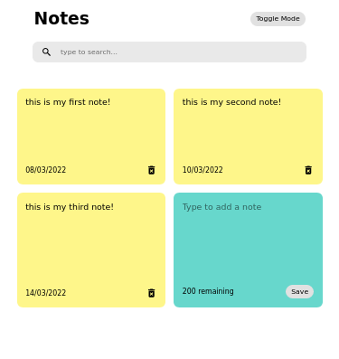

## DESCRIPTION:
- Follow along with Chris Blakely's React class: 
- a React Notes App, made with React + styled component.
- Features: 
    - light/dark mode.
    - save & retrieve from local storage

## TECH STACKS:
- React
- Icons: React-icons,
- Hooks: useState, useEffects
- styling: Styled Components.

## PROGRESS:
- 100%;
- Mobile Responsive? YES.

## How to run
`yarn install`
`yarn start`

## View other projects:
- [My Blog](https://hashnode.com/@marizoo)
- [My Pinterest](https://pin.it/16vGwjy)
- [My Youtube Channel](https://www.youtube.com/channel/UCfkbnM9WvHD3mjecBiGHCBQ/playlists)

## IMAGE:

